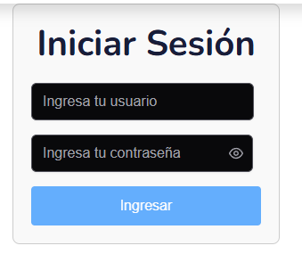

# CBA Sucre - plataforma Web Educativa

## Ejecucion del frontend

### Variables de entorno

```
VITE_BASE_URL_API=http://localhost:3300
```

### Instalacion de dependencias
```
npm install
```
### Ejcucion del proyecto
```
npm run dev
```

## Ejecucion del backend

### Variables de entorno

```
PORT=
BASE_URL=
DB_HOST=
DB_PORT=
DB_USER=
DB_PASSWORD=
DB_NAME=cba_sucre

DEFAULT_PASSWORD=
JWT_SECRET=mi_clave_secreta
JWT_TOKEN_EXPIRATION=
FRONTEND_URL=http://localhost:5173
```
se debe tomar en cuenta que se debe tener creada la base de datos antes de ejecutar el backend
### Instalacion de dependencias
```
npm install
```

### Ejecucion basica de usuarios en sql
```
# Para roles

insert into roles(id, name, description) values ("role1","admin", "Este rol tiene acceso al modulo de administracion");
insert into roles(id, name, description) values ("role2", "user" ,"Este rol tiene solo puede acceder a la web");

# Para Usuario por defecto

insert into usuarios(id, name, password, email, roleId) values ("user1","admin", "$2a$12$PSS1f99j25mSppg.MrOvo.bD6VDjr4XrsEKBou8DuRhxZzjz0.Bee", "admin@gmail.com", "role1");
```

### Ejcucion del proyecto
```
npm run start:dev
```

## Uso del proyecto

### Loggin

Por defecto el usuario y contraseña sera admin - admin:


### Acceso al Admin
El frontend validara los roles correspondientes, el usuario podra acceder al admin si y solo si es admin:

```
http://localhost:5173/admin
```